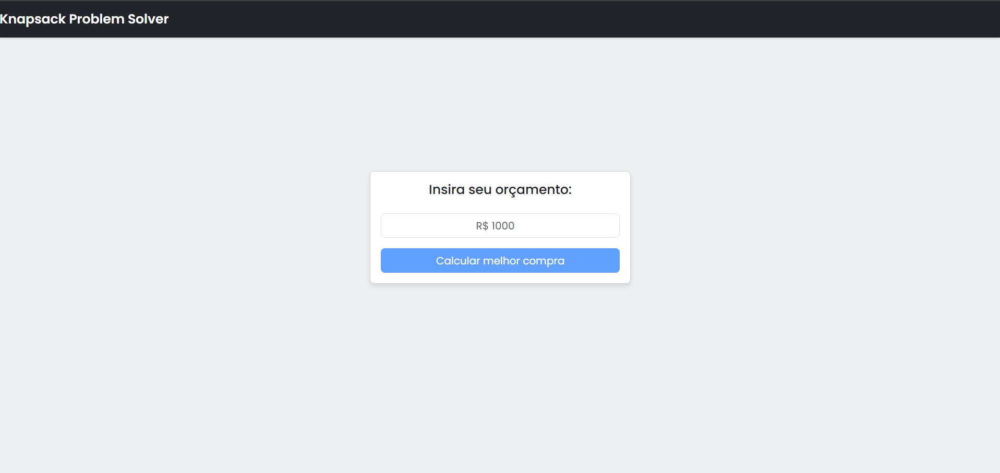
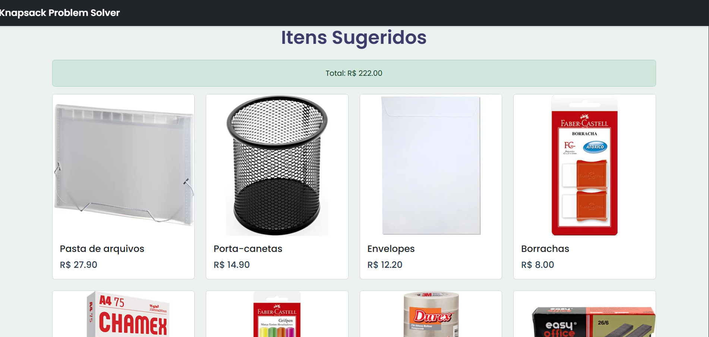

# PD-knapsack-Dupla34


Temas:

 - Programação Dinâmica


**Número da Lista**: 34 <br>

**Conteúdo da Disciplina**: knapsack<br>


## Alunos

|Matrícula | Aluno |

| -- | -- |

| 20/2045769  |  Gabriel Saraiva Canabrava|

| 19/0087188  |  Fillipe Souto de Andrade |


## Sobre 


Este projeto é uma aplicação web interativa para otimização de compras de materiais escolares, desenvolvida como parte da disciplina de Projetos de Algoritmos. A aplicação utiliza programação dinâmica para resolver o problema da mochila (knapsack problem), otimizando a seleção de produtos dentro de um orçamento definido pelo usuário.


### Objetivo

O projeto tem como objetivo demonstrar a aplicação prática do algoritmo de Programação Dinâmica na resolução do problema da mochila, permitindo que usuários encontrem a melhor combinação de produtos escolares dentro de um limite de orçamento, maximizando o valor total da compra.


### Tecnologias Utilizadas

- **Algoritmo Knapsack (Mochila)**: Implementado usando programação dinâmica com memoização para otimização de desempenho

- **Memoização**: Técnica utilizada para armazenar resultados já calculados, evitando recálculos desnecessários

- **React**: Framework JavaScript para desenvolvimento web

- **React Bootstrap**: Biblioteca de componentes UI para interface responsiva

- **JavaScript**: Linguagem de programação


### Funcionalidades

- Catálogo de produtos escolares e livros com preços

- Sistema de otimização que encontra a melhor combinação de produtos dentro do orçamento

- Interface moderna e responsiva para visualização de produtos e resultados

- Cálculo automático do valor total da compra otimizada

- Visualização detalhada dos itens selecionados pela solução


## Screenshots








## Instalação 


### Pré-requisitos

- Node.js (versão 18 ou superior)

- npm ou yarn


### Tecnologias

- **Linguagem**: JavaScript

- **Framework**: React

- **Bibliotecas**: React Bootstrap, React Router DOM


### Passos para instalação


1. Navegue até o diretório do projeto:

```bash

cd novo-projeto

```


2. Instale as dependências:

```bash

npm install

```


3. Execute o projeto em modo de desenvolvimento:

```bash

npm start

```


4. Acesse a aplicação no navegador:

```

http://localhost:3000

```


## Videos


https://unbbr-my.sharepoint.com/:v:/g/personal/202045769_aluno_unb_br/IQBH-GnEptJPQL-V4BRKZBY0ARGcrHiJ1grtociod9W8_GM?nav=eyJyZWZlcnJhbEluZm8iOnsicmVmZXJyYWxBcHAiOiJTdHJlYW1XZWJBcHAiLCJyZWZlcnJhbFZpZXciOiJTaGFyZURpYWxvZy1MaW5rIiwicmVmZXJyYWxBcHBQbGF0Zm9ybSI6IldlYiIsInJlZmVycmFsTW9kZSI6InZpZXcifX0%3D&e=hawYUU

